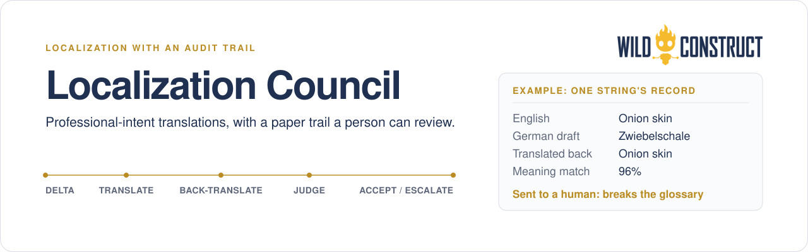
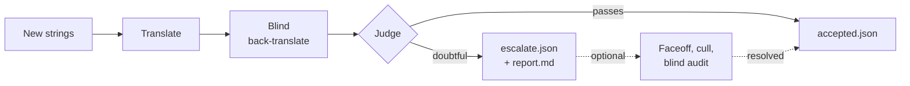

<div align="center">
  <picture>
    <source media="(prefers-color-scheme: dark)" srcset=".github/assets/banner-dark.svg">
    <source media="(prefers-color-scheme: light)" srcset=".github/assets/banner-light.svg">
    
  </picture>

  <p>For people shipping software to real users in other languages who want translations that read like a native professional wrote them, with a paper trail a person can review.</p>

  <p>
    <a href="https://github.com/WildConstruct/localization-council/actions/workflows/ci.yml"></a>
    <a href="https://github.com/WildConstruct/localization-council/security/code-scanning"></a>
    <a href="LICENSE"></a>
    <a href="package.json"></a>
    <a href="package.json"></a>
  </p>

  <p><a href="#quick-start">Quick start</a> · <a href="#how-it-works">How it works</a> · <a href="#for-agents-and-mcp">MCP</a> · <a href="#docs">Docs</a></p>
</div>

## Why it exists

Machine translation of product UI is usually fluent. Most mistakes are fluent too: a literal calque that confuses professional users, or a "Rendering…" that quietly becomes "Processing…".

Localization Council drafts each string with the glossary you provide, checks it through independent stages, and sends doubtful rows to a person. The reviewer need not speak the target language. Every flag carries the source, candidate, blind back-translation, and reason.

## How it works



Translate drafts each string with your glossary and checks placeholders and ICU structure. A model from a different vendor back-translates it without seeing the English source. The judge compares that back-translation with the source and scores meaning, fluency, and glossary compliance.

The optional stages run with `--faceoff --consensus-cull --blind-audit`; each winner must pass the same core checks before it reaches `accepted.json`. Not built yet: [domain research](https://github.com/WildConstruct/localization-council/issues/1), a [separate semantic-drift stage](https://github.com/WildConstruct/localization-council/issues/2), and [glossary generation](https://github.com/WildConstruct/localization-council/issues/3).

- **Accept into output:** write a candidate to `accepted.json` under `--out`.
- **Merge:** a person moves selected strings into the product catalog. The council never merges.

Runs use one of three profiles: offline deterministic `mock`, OpenRouter with one API key, or the `claude`, `grok`, and `codex` terminal CLIs with `fleet`. Results are cached, and `manifest.json` records the run configuration, tool versions, and available cost data.

## Quick start

From a fresh clone:

```bash
git clone https://github.com/WildConstruct/localization-council && cd localization-council
node src/cli.mjs doctor
node src/cli.mjs run --profile=mock --catalog fixtures/toy/en.json --locale de --glossary fixtures/toy/glossary.de.json
```

The mock run exits `10` with 17 accepted strings and 3 escalations. Its artifacts are in `scores/de/`. To install the `council` command:

```bash
npm install -g github:WildConstruct/localization-council
```

OpenRouter uses one key:

```bash
export OPENROUTER_API_KEY=…
council doctor --online
council run --profile=openrouter --catalog locales/en.json --locale de --target locales/de.json
council run --preset budget --catalog locales/en.json --locale de --target locales/de.json
```

Fleet uses the terminal CLIs already logged in:

```bash
council doctor
council run --profile=fleet --catalog locales/en.json --locale de --target locales/de.json
```

`--target` limits work to missing or untranslated keys. `--out` defaults to `scores/<locale>/`.

| Artifact | Contents |
|---|---|
| `candidates.json` | Drafts plus placeholder and ICU checks |
| `backtranslations.json` | Blind back-translations |
| `scores.json` | Judge verdicts |
| `accepted.json` | Strings accepted into output |
| `escalate.json`, `report.md` | Review rows in structured and readable forms |
| `manifest.json` | Profile, models, thresholds, seed, tools, cost, and cache hits |

## OpenRouter presets

Pick one with `--preset`. The `openrouter` profile uses `balanced` by default.

| Preset | Translate | Back-translate | Judge | Cost |
|---|---|---|---|---|
| `balanced` | `anthropic/claude-opus-5.5` | `x-ai/grok-4.7` | `openai/gpt-5.6-sol` | 1x |
| `budget` | `deepseek/deepseek-v4.1-flash` | `google/gemini-3.5-flash-lite` | `openai/gpt-5.6-sol` | about 1/2 |
| `cheapest` | `deepseek/deepseek-v4.1-flash` | `google/gemini-3.5-flash-lite` | `openai/gpt-6-luna` | about 1/13 |

- **balanced:** strongest translator, cross-vendor blind back-translation, strong judge.
- **budget:** cheap translate and back-translate, same strong judge. The judge is where cheaper models lost the most.
- **cheapest:** every stage on a low-cost model. It catches blatant meaning drift but misses most subtle terminology problems. Use it for drafts and smoke runs, not sign-off.

See the [model bakeoff](docs/model-bakeoff.md) for the evidence, the [model-selection skill](skills/model-selection/SKILL.md) for choosing presets and stage overrides, and [`config/models.json`](config/models.json) for the source of truth.

## A glossary entry

Glossaries record product meaning, practitioner terminology, and rejected terms with reasons. See the [glossary schema](schemas/glossary.v0.json). From the [toy German glossary](fixtures/toy/glossary.de.json):

```json
{
  "source": "onion skin",
  "locale": "de",
  "productMeaning": "Semi-transparent overlay of adjacent frames for frame-by-frame animation.",
  "practitionerTerm": "Onion Skin",
  "approved": true,
  "rejected": [
    { "term": "Zwiebelschale", "why": "Calque that confuses artists; keep English loan in UI." }
  ]
}
```

## An escalated row

| Key | Source | Candidate | Back-translation | Meaning | Reason |
|---|---|---|---|---:|---|
| `ui.viewport.onion` | Onion skin | Zwiebelschale | Onion skin | 0.96 | Glossary violation: rejected calque |

Meaning alone would pass this row. The glossary catches the terminology problem and leaves the evidence for review.

Adding `--faceoff --consensus-cull --blind-audit` makes the council try other providers for escalated rows, and in the mock demo it accepts "Onion Skin" once two independent candidates agree and pass every check.

## For agents and MCP

The stdio MCP server exposes the same workflow. See [MCP setup](docs/mcp.md) and the operating contract in [AGENTS.md](AGENTS.md).

Every subcommand accepts `--json` and prints one object matching the [summary schema](schemas/summary.v1.json). Exit codes are `0` clean, `10` escalations or tidy reopen rows, `1` error, `2` usage, and `3` doctor preflight failed.

## Docs

- [Pipeline internals](docs/pipeline.md) and [design notes](docs/design-notes.md)
- [Post-escalate resolution](docs/escalate-resolution.md) and [retrospective tidy](docs/retrospective-tidy.md)
- [Fleet CLIs](docs/fleet-cli.md), [OpenRouter](docs/openrouter.md), and [Jev decision gates](docs/jev-gates.md)
- [Multi-repo gardens](docs/garden.md), [scheduled routines](docs/routines/scheduled-agent.md), and [CI delta checks](docs/ci-delta.md)
- [Model bakeoff](docs/model-bakeoff.md), [results](docs/results.md), and [roadmap](docs/backlog.md)

## Contributing and security

Read [CONTRIBUTING.md](CONTRIBUTING.md) before opening a pull request. [Good first issues](docs/good-first-issues.md) and the [issue templates](.github/ISSUE_TEMPLATE/) are useful starting points. `npm test` runs the offline suite.

Report vulnerabilities privately through [GitHub private vulnerability reporting](https://github.com/WildConstruct/localization-council/security/advisories/new), as described in [SECURITY.md](SECURITY.md). If that is unavailable, email [support@wildconstruct.com](mailto:support@wildconstruct.com).

## About Wild Construct

Wild Construct makes tools for artists. Our mission is to build professional creative tools that
expand what artists can do without increasing their dependence on the companies that make them.

We hold ourselves to [The Artist Compact](https://wildconstruct.com/compact/). Its core idea is
that a tool should increase an artist's capability without increasing their captivity. The Compact
judges every tool we make by seven properties: Directable, Embodied, Decomposed, Persistent,
Low-friction, Accessible, and Legible.

We hope to keep building better tools for artists, and to build more of them in the open.
Localization Council is one small part of that. Creative software should meet artists in their own
language, and the words in a UI carry real craft knowledge. This harness keeps that work open,
legible, and auditable: every accepted string and every escalation leaves a trail that a person can
read, reproduce, and question.

## License

MIT. See [LICENSE](LICENSE). Maintained by Wild Construct.
